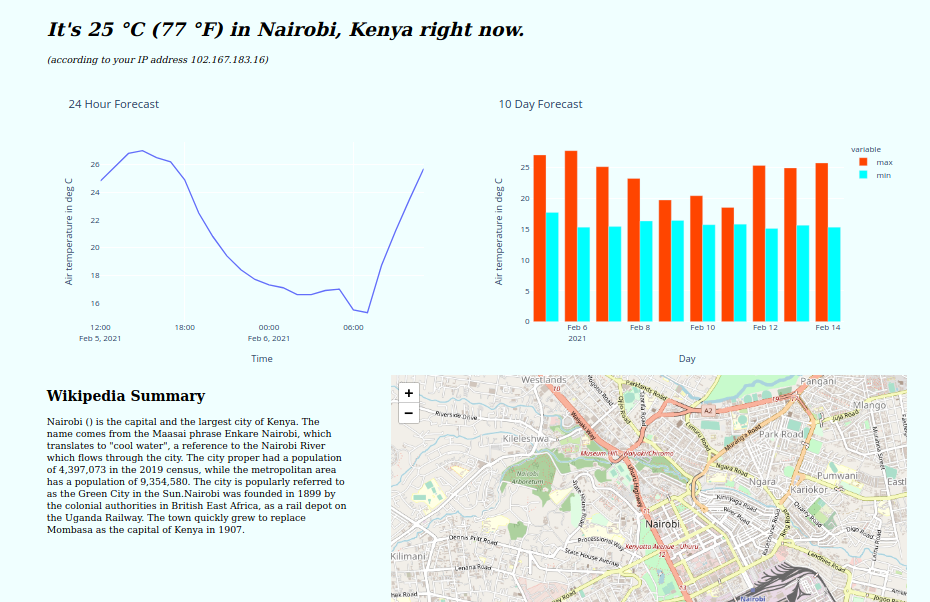

# Weather Greeting Application

This project demonstrates how to use Python to create web applications. It is primarily meant for educational purposes, specifically created for the *WorldQuant University - Introduction to Data Science* Module.

The skills and tools primarily used are:

- Python's `requests` package.
- Python's `flask` web framework.
- Working with JSON.
- Modular programming.

The application:

1. Fetches a client's IP address.
1. Uses the IP address to look up the client's public location.
1. Provides a weather update for the city the client is in.

## Getting started

Clone the repository to get the necessary files:

    git clone https://github.com/Tim-Abwao/wqu-weather-app.git

Afterwards, create a virtual environment, and install the required packages. You can use the provided `Makefile` to create a virtual environment by running `make` or `make all`. You can also do this manually.

For *Linux/Mac*:

    python3 -m venv venv
    source venv/bin/activate
    pip install -U pip
    pip install -r requirements.txt

For *Windows*:

    py -3 -m venv venv
    venv\Scripts\activate
    pip install -U pip
    pip install -r requirements.txt

If you wish to deploy the app to Heroku, you will additionally need a Heroku account, and to have installed the [Heroku CLI](https://devcenter.heroku.com/articles/heroku-cli#download-and-install).

## Running the app locally

To run the *Flask development server*, you can use the command `make develop`. You can also use the commands:

    export FLASK_APP=weather_app
    export FLASK_ENV=development
    flask run

For *Windows*:

    set FLASK_APP=weather_app
    set FLASK_ENV=development
    flask run

Then browse to <http://127.0.0.1:5000/>.

Another alternative is [Docker](https://www.docker.com/):

    docker build -t weather_app .
    docker run -d -p 5000:5000 --name flask_weather_app weather_app

The browse to <http://0.0.0.0:5000/>

## Deploying to Heroku

Make sure your app is ready to be deployed to Heroku by confirming that it successfully runs locally. Then use the commands:

    heroku login
    heroku create your-apps-name-goes-here
    git push heroku main
    heroku config:set DEPLOY=heroku
    heroku open

## Future work

Since this is a short demonstration of what you can do using Python to create web applications, consider extensions to the project. Some ideas include:

1. Showing a plot of the weather forecast.
1. Using clients' location to display other location specific data.

## Contributing to this project

Please see the [contribution guidelines](CONTRIBUTING.md).

## Contributors

Thanks to the following people who have contributed to this project:

- [xofbd](https://github.com/xofbd)
- [gammaG2](https://github.com/gammaG2)
- [T. A.](https://github.com/Tim-Abwao)

## License

This project is distributed under the GNU General Purpose License. Please see [LICENSE](LICENSE) for more information.
